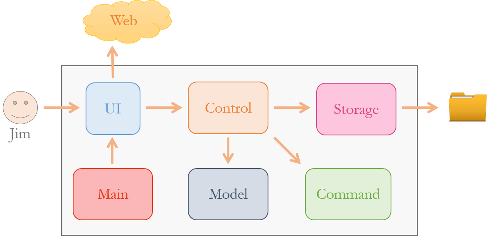

# Developer Guide

* [Introduction](#introduction)
* [Setting Up](#setting-up)
    * [Prerequisites](#prerequisites)
    * [Importing project into Eclipse](#importing-project-into-eclipse)
    * [Troubleshooting](#troubleshooting)
* [Design](#design)
    * [Architecture](#architecture)
    * [View](#view)
    * [Controller]
    * [Model]
* [Testing](#testing)
* [Appendices](#appendices)
    * [Appendix A: User Stories](#appendix-a--user-stories)
    * [Appendix B: Use Cases](#appendix-b--use-cases)
    * [Appendix C: Non Functional Requirements](#appendix-c--non-functional-requirements)
    * [Appendix D: Glossary](#appendix-d--glossary)
    * [Appendix E: Product Survey](#appendix-e--product-survey)

## Introduction
Linenux is a command-line, task manager application designed for consumers who are quick at typing. Being an open-source project, we understand that there are developers (yes, you) who wants to contribute to the project but do not know where to begin. Thus, we have written this guide to inform newcomers to the project on the key design considerations and the overall software architecture. We hope that by the end of this developer guide, you will in a better position to start working on improving Linenux.

## Setting up

#### Prerequisites

1. **JDK 8** or later.
2. **Eclipse** IDE with **e(fx)clipse** plugin. Follow the instructions given on their [website](https://www.eclipse.org/efxclipse/install.html#for-the-ambitious).
3. **Scene Builder 8.0**. Available for download [here](http://gluonhq.com/labs/scene-builder/).
4. **Gradle**. Follow the instuctions on their [website](https://docs.gradle.org/current/userguide/installation.html?_ga=1.32481590.94426092.1475838180).

#### Importing project into Eclipse

1. Fork this repository and clone the fork to your computer.
2. Open the Eclipse application.
3. Click `File` > `Import` > `General` > `Existing Projects into Workspace` > `Next`.
4. Click `Browse`, then locate the project's directory.
5. Click `Finish`.
6. Run `gradle run` in your terminal to ensure that everything is working properly.

#### Troubleshooting

1. **Eclipse reports that some of the required libraries are missing.**
    * Reason: Required libraries were not downloaded during project import.
    * Solution: Run `gradle test` in your terminal once to refresh libraries.
2. **Eclipse reports compile errors after new commits are pulled from Git.**
    * Reason: Eclipse fails to detect the changes made to your project during `git pull`.
    * Solution: Refresh your project in Eclipse by clicking on it in the package explorer window and pressing `F5`.

## Design

#### Architecture

> Figure 1: Architecture Diagram

Linenux follows the Model-View-Controller (MVC) pattern which is made up of 3 main components.

1. **Model** is where Linenux's data objects are stored. It is independent from the view and controller.
2. **View** is the window that our user sees and interacts with. It updates whenever there are changes to the model.
3. **Controller** is the decision maker and the glue between model and view.

1. **Main** - Sets up the main application window during program's startup.
2. **UI** - Regulates user interaction and display.
3. **Control** - Assigns user request to the correct action.
4. **Command** - Carries out the action.
5. **Model** - Stores the data of Linenux in-memory.
6. **Storage** - Reads data from, and writes data to, the hard disk.

#### View component

## Testing

* In Eclipse, right-click on the `test` folder and choose `Run as` > `JUnit Test`

## Appendices

## Appendix A : User Stories

Priorities: High (must have) - `* * *`, Medium (nice to have)  - `* *`,  Low (unlikely to have) - `*`

Priority | As a ...  | I want to ...                             | So that I can ...
-------- | :-------- | :---------------------------------------  | :---------------
`* * *`  | user      | see usage instructions                    | have a reference on how to use the App in the event that I do not know the commands or have forgotten them.
`* * *`  | user      | add a new task                            |
`* * *`  | user      | edit a task                               | update the deadlines or other details regarding the task.
`* * *`  | user      | delete a task                             | remove tasks that I no longer need.
`* * *`  | user      | search a task                             | check the details of the task.
`* * *`  | user      | list tasks by day or deadlines            | plan ahead.
`* * *`  | user      | undo previous commands                    | correct any erroneous actions.
`* *`    | user      | set reminders for tasks                   | make preperations before their stipulated deadlines.
`* *`    | user      | have multiple language support            | choose my preferred working language.
`* *`    | user      | find free time slots                      | make appointments with others.
`* *`    | user      | have a day/week/month view                | more easily digest the information.
`* *`    | user      | print the schedule for the day/week/month | have a hard copy of my schedule.
`* *`    | user      | sync with Google Calendar                 | have the option to view on any devices with access to the Internet.
`*`      | user      | see syntax highlighting                   | more easily discern special keywords and commands.
`*`      | user      | see notifications                         | be constantly reminded without having to open the App.
`*`      | user      | have a mini-window mode                   | the application does not take up the whole screen.

## Appendix B : Use Cases

#### Use case:

**MSS**

**Extensions**

## Appendix C : Non Functional Requirements

## Appendix D : Glossary

## Appendix E : Product Survey
