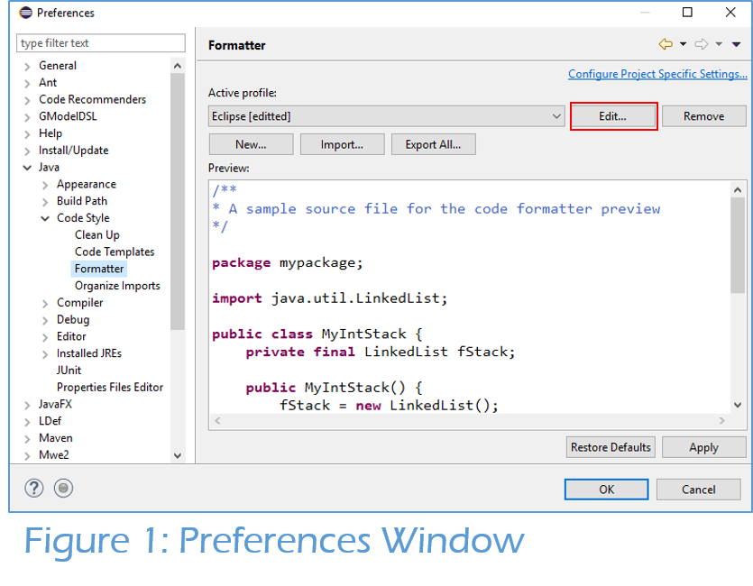
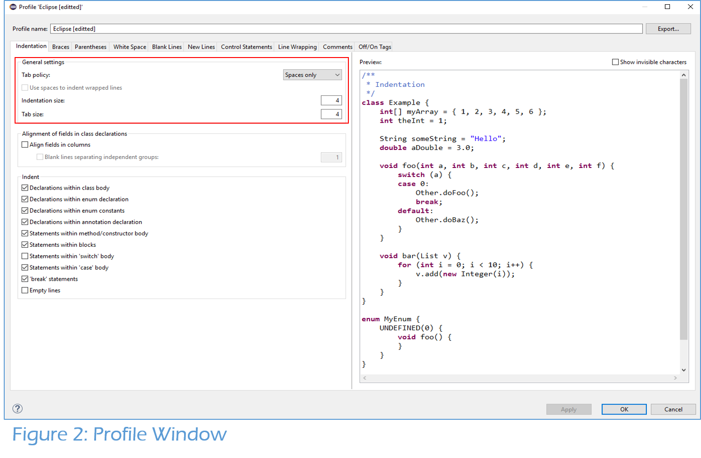
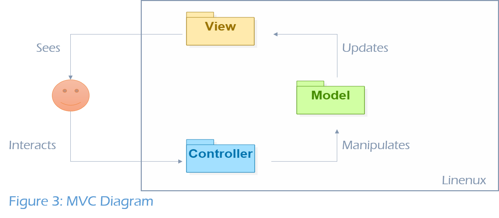
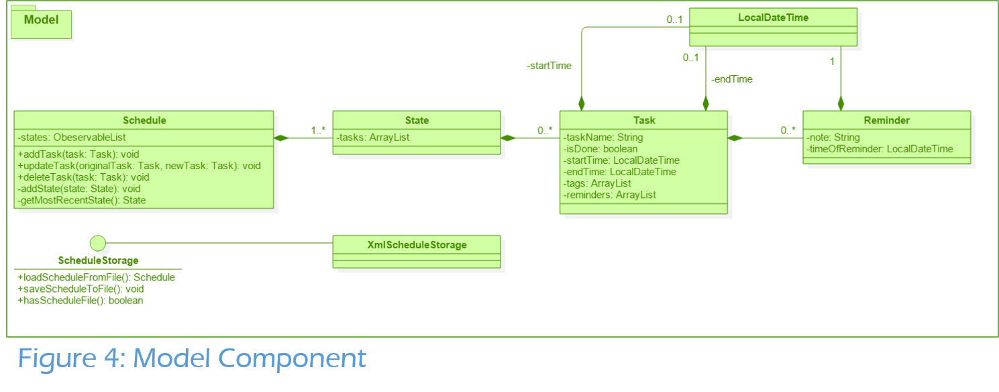
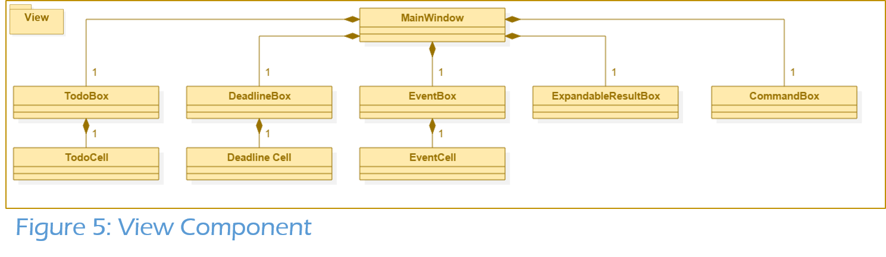
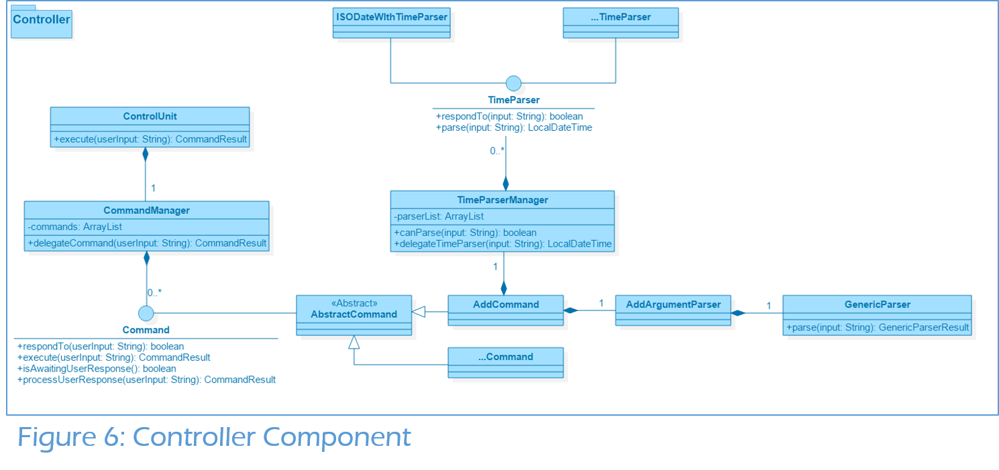
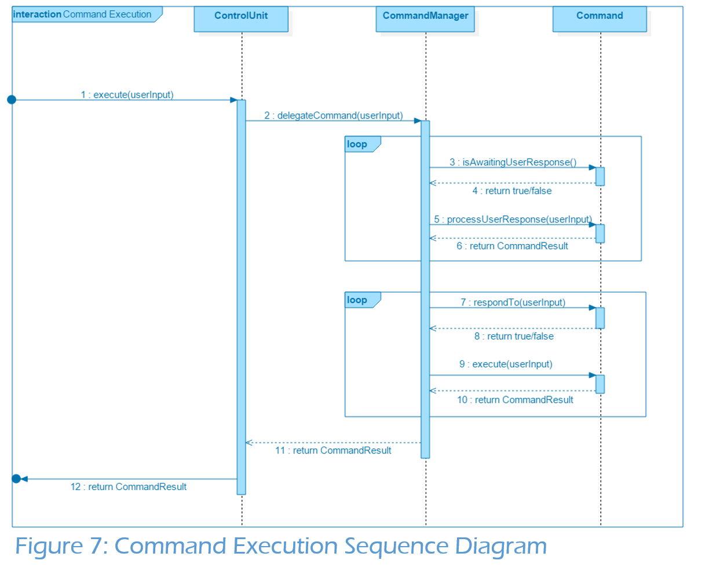
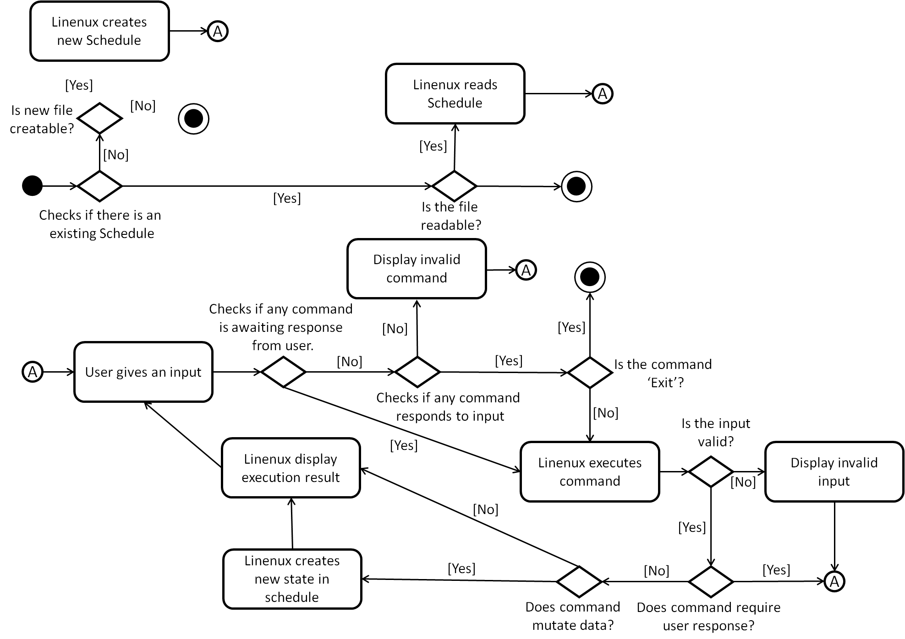

# Developer Guide

* [Introduction](#introduction)
* [Setting Up](#setting-up)
    * [Prerequisites](#prerequisites)
    * [Importing project into Eclipse](#importing-project-into-eclipse)
    * [Coding Standards](#coding-standards)
    * [Troubleshooting](#troubleshooting)
* [Design](#design)
    * [Architecture](#architecture)
    * [Model Component](#model-component)
    * [View Component](#view-component)
    * [Controller Component](#controller-component)
    * [Activity Diagram](#activity-diagram)
* [Logging](#logging)
* [Testing](#testing)
    * [In Eclipse](#in-eclipse)
    * [Using Gradle](#using-gradle)
    * [Types of Test](#types-of-test)
* [Dev Ops](#dev-ops)
    * [Build Automation](#build-automation)
    * [Continuous Integration](#continuous-integration)
    * [Making a Release](#making-a-release)
    * [Managing Dependencies](#managing-dependencies)
* [Appendices](#appendices)
    * [Appendix A: User Stories](#appendix-a--user-stories)
    * [Appendix B: Use Cases](#appendix-b--use-cases)
    * [Appendix C: Non Functional Requirements](#appendix-c--non-functional-requirements)
    * [Appendix D: Glossary](#appendix-d--glossary)
    * [Appendix E: Product Survey](#appendix-e--product-survey)

## Introduction
Linenux is a command-line, task manager application designed for consumers who are quick at typing. Being an open-source project, we understand that there are developers (yes, you) who want to contribute to the project but do not know where to begin. Thus, we have written this guide to inform newcomers to the project on the key design considerations and the overall software architecture. We hope that by the end of this developer guide, you will in a better position to start working on improving Linenux.
 

## Setting up

#### Prerequisites

1. **JDK 8** or later.
2. **Eclipse** IDE with **e(fx)clipse** plugin. Follow the instructions given on their [website](https://www.eclipse.org/efxclipse/install.html#for-the-ambitious).
3. **Scene Builder 8.0**. Available for download [here](http://gluonhq.com/labs/scene-builder/).
4. **Gradle**. Follow the instuctions on their [website](https://docs.gradle.org/current/userguide/installation.html?_ga=1.32481590.94426092.1475838180).

#### Importing project into Eclipse

1. Fork this repository and clone the fork to your computer.
2. Open the Eclipse application.
3. Click `File` > `Import` > `General` > `Existing Projects into Workspace` > `Next`.
4. Click `Browse`, then locate the project's directory.
5. Click `Finish`.
6. Run `gradle eclipse` in your terminal to set up the folders in Linenx.
7. Run `gradle run` in your terminal to ensure that everything is working properly.

#### Coding Standards
Our coding standards can be found [here](https://oss-generic.github.io/process/codingstandards/coding-standards-java.html).

To ensure code readablity on Github, please follow the following instructions to set up your Code Formatter Profile on Eclipse:

1. Click `Window` > `Preferences`.
2. Expand `Java` > `Code Style` and select `Formatter`.
3. Click the `Edit` button.

    

4. In the `Indentation` tab, under `General settings`, change `Tab Policy` to Spaces Only and check that `Indentation Size` and `Tab Size` are both set to 4.
5. Click `OK` to save the profile.

    

#### Troubleshooting

1. **Eclipse reports that some of the required libraries are missing.**
    * Reason: Required libraries were not downloaded during project import.
    * Solution: Run `gradle test` in your terminal once to refresh libraries.
2. **Eclipse reports compile errors after new commits are pulled from Git.**
    * Reason: Eclipse fails to detect the changes made to your project during `git pull`.
    * Solution: Refresh your project in Eclipse by clicking on it in the package explorer window and pressing `F5`.

## Design

#### Architecture

Linenux follows the Model-View-Controller (MVC) pattern which is made up of 3 main components.

1. **Model** is where Linenux's data objects are stored. It is independent from the view and controller.
2. **View** is the window that our user sees and interacts with. It updates whenever there are changes to the model.
3. **Controller** is the decision maker and the glue between model and view.

#### Model Component

##### *Schedule and State class*

The **Schedule** class stores the data of **Task** and **Reminder** instances in-memory. To facillitate the `undo` command, we introduce an intermediary class known as **State**. A **State** object represents the state of the **Schedule** class at a point in time. A new **State** object is added to the **Schedule** class whenever a task or reminder is created, updated or deleted. Thus, to `undo` a command, we can simply discard the most recent **State**.

To properly capture the above behaviour, we have made **State**, **Task** and **Reminder** classes immutable. An immutable object is an object whose state cannot be modified after it is created. This means that any modification to a **Task** or **Reminder** object will cause a new **State** object to be added. This is why any methods that mutate the data should do so via the **Schedule** class.

Specifically, we have exposed three mutation methods:

1. `addTask`
2. `updateTask`
3. `deleteTask`

*Notable APIs:* [`Schedule.java`](https://github.com/CS2103AUG2016-W11-C1/main/blob/master/src/main/java/linenux/model/Schedule.java)

| Return type  | Method and Description                                                                                      |
| ------------ | ------------------------------------------------------------------------------------------------------------|
| void         | `addTask(Task task)`: Adds the task into the schedule.                                                      |
| void         | `updateTask(Task originalTask, Task newTask)`: Updates the original task in the schedule with the new task. |
| void         | `deleteTask(Task task)`: Deletes the task from the schedule.                                                |
| State        | `getMostRecentState()`: Returns the most recent state of schedule.                                          |
| void         | `addState(State)`: Adds a new state into the list of states.                                                |

##### *Task and Reminder Class*

We classify all types of tasks into three categories:

1. **Deadlines** - tasks that have an end time but no start time.
2. **Events** - tasks that have both start and end times.
3. **To-dos** - tasks that have neither start nor end times.

Note that we do not allow tasks with start time but without end time. A **Task** object is unique and no two **Task** object can have the same task name, start time and end time.

A **Task** object can have tags and reminders. Tags are strings that allow users to further categorize their tasks, while reminders notify users on certain key points as the task draw nearer to its end time. 

##### *ScheduleStorage Interface*

The **ScheduleStorage** interface defines the necessary methods that the **Controller** requires to read and write to a file type. It allows the data to persist when the user exits the application. Currently, all schedule files are saved as an XML file type format but you can extend it to other file types by implementing this interface.

*Notable APIs:* [`ScheduleStorage.java`](https://github.com/CS2103AUG2016-W11-C1/main/blob/master/src/main/java/linenux/storage/ScheduleStorage.java)

| Return type | Method and Description                                                            |
| ----------- | ----------------------------------------------------------------------------------|
| Schedule    | `loadScheduleFromFile()`: reads a file and returns the schedule from the file.    |
| void        | `saveScheduleToFile(Schedule schedule)`: writes the given schedule into the file. |
| Boolean     | `hasScheduleFile()`: checks if the schedule file exits.                           |

#### View Component

The **View Component** uses the JavaFx UI framework. The layout of these UI parts are defined in the matching `.fxml` files that are found in the `src/main/resources/view` folder. Similarly, the look of these UI parts are styled in their respective `.css` files found in the same folder.

#### Controller Component

##### *ControlUnit Class*

The **ControlUnit** class is the "brain" of Linenux and is responsible for setting up the application. Its responsibilities are:

1. Retreiving the appropriate schedule file from storage and initializing the **Schedule** class.
2. Initializing an instance of the supported commands.
3. Passes the user input to the **Command** class.
4. Relays any feedback from the **Command** class to the **View** component.

##### *CommandManager Class*

The **CommandManager** class is responsible for delegating the user input to the right command. The sequence diagram below shows the flow of a typical command.

Since some commands require some form of user response, we will first check if any commands are awaiting user response. Note that at most one command can be awaiting user response at any point in time. If there are no command waiting for user response, it is assumed that the user entered a command and the **CommandManager** class will assign the right command based on the user input. Finally, a feedback in the form of a **CommandResult** instance will be returned and displayed in the **View** component.

##### *Command Interface*

**Command** interface defines the necessary methods that **CommandManager** requires to allocate the correct command based on the user input.

*Notable APIs:* [`Command.java`](https://github.com/CS2103AUG2016-W11-C1/main/blob/master/src/main/java/linenux/command/Command.java)

| Return type   | Method and Description                                                                                           |
| --------------| -----------------------------------------------------------------------------------------------------------------|
| Boolean       | `respondTo(String userInput)`: checks if command responds to userInput.                                          |
| CommandResult | `execute(String userInput)`: executes the command.                                                               |
| Boolean       | `isAwaitingUserResponse()`: checks if the command is awaiting for a response from the user.                      |
| CommandResult | `processUserResponse(String userInput)`: carries out user response.                                              |

##### *AbstractCommand Class*

As many of the commands are similar in their implementation of some of the interface methods, we have abstracted the implementation into the **AbstractCommand** class.

*Notable APIs:* [`AbstractCommand.java`](https://github.com/CS2103AUG2016-W11-C1/main/blob/master/src/main/java/linenux/command/AbstractCommand.java)

| Return type | Method and Description                                         | 
| ----------- | ---------------------------------------------------------------|
| String      | `getPattern()`: returns regex pattern.                         |
| void        | `setAlias(String alias)`: set a new alias for the command.     |
| void        | `removeAlias(String alias)`: removes an alias for the command. |

##### *TimeParserManager Class and TimeParser Interface*

These two classes work similarly as the **CommandManager** class and **Command** interface. The **TimeParserManager** class is responsible for delegating the user input to the right **TimeParser** instance.

*Notable APIs:* [`TimeParserManager.java`](https://github.com/CS2103AUG2016-W11-C1/main/blob/master/src/main/java/linenux/control/TimeParserManager.java)

| Return type   | Method and Description                                                                              |
| --------------| ----------------------------------------------------------------------------------------------------|
| Boolean       | `canParse(String userInput)`: checks if manager can parse the time format.                          |
| CommandResult | `delegateTimeParser(String userInput)`: assigns the right TimeParser that can read the time format. |

*Notable APIs:* [`TimeParser.java`](https://github.com/CS2103AUG2016-W11-C1/main/blob/master/src/main/java/linenux/time/parser/TimeParser.java)

| Return type   | Method and Description                                                             |
| --------------| -----------------------------------------------------------------------------------|
| Boolean       | `respondTo(String userInput)`: checks if TimeParser can parse the time format.     |
| LocalDateTime | `parse(String userInput)`: converts the time string into a LocalDateTime instance. |

##### *GenericParser Class*

For complex commands that requires searching and mutating the data, we have abstracted the parsing implementation so that commands that have the format `command KEYWORDS flag1/value1 flag2/value2` can use the **GenericParser** class. It separates the user input into the keywords, and the flags and their respective values are put into a hash table with the flags as keys.

#### Activity Diagram

> Figure 8: Acitivity Diagram of Linenux

The above activity diagram shows the generic flow of activities in Linenux.

## Logging

We are using `java.util.logging` package for logging. The **LogsCenter** class is used to manage the logging levels
and logging destinations.

* The `Logger` for a class can be obtained using `LogsCenter.getLogger(Class)` which will log messages according to
  the specified logging level
* Currently log messages are output through: `Console` and to a `linenux.log` file.

**Logging Levels**

* `SEVERE` : Critical problem detected which may possibly cause the termination of the application
* `WARNING` : Can continue, but with caution
* `INFO` : Information showing the noteworthy actions by the App
* `FINE` : Details that is not usually noteworthy but may be useful in debugging
  e.g. print the actual list instead of just its size

## Testing

Tests can be found in the `./src/test/java` folder. 

#### In Eclipse

* To run all tests, right click on the `src/test/java` folder in the package explorer and choose `Run as` > `JUnit Test`.
* To run a subset of tests, you can right click on a test package, test class or a test in the package explorer and choose `Run as` > `JUnit Test`.

#### Using Gradle

* To run all tests, run `gradle test` command in the terminal.

#### Types of Test

##### *Unit Tests*

Example: [`TodayWithTimeParserTest.java`](https://github.com/CS2103AUG2016-W11-C1/main/blob/e850198163971412ddcde7c2da6cbcaf416f77a5/src/test/java/linenux/time/parser/TodayWithTimeParserTest.java)

The **TodayWithTimeParser** class is chosen to be a unit of test. It is considered unit test as the unit
does not interact with other parts of the code. This is achieved by injecting mocked dependencies. In this case,
**TodayWithTimeParser** needs to determine the current time. A mocked **Clock** object is injected and will always return the same
time.

##### *Integration Tests*

Example: [`AddCommandTest.java`](https://github.com/CS2103AUG2016-W11-C1/main/blob/e850198163971412ddcde7c2da6cbcaf416f77a5/src/test/java/linenux/command/AddCommandTest.java#L127-L142)

The `execute_validEvent_taskAdded` test ensures that the **AddCommand**, **Schedule**, **State**, and **Task** classes work in tandem
and produce the expected changes in response to a user input.

Example: [`AutoCompleteTest.java`](https://github.com/CS2103AUG2016-W11-C1/main/blob/e850198163971412ddcde7c2da6cbcaf416f77a5/src/test/java/linenux/gui/AutoCompleteTest.java)

The **AutoCompleteTest** ensures that the **CommandBoxController**, **AutoCompleter**, and **TernarySearchTree** integrates well. This
is done by simulating an actual user interaction and ensure that the expected suggestion show up in the command box.

## Dev Ops

#### Build Automation

Gradle is a build automation tool. It can automate build-related tasks such as:
* Running tests
* Managing library dependencies
* Analysing code for style compliance

The gradle configuration for this project is defined in the build script `build.gradle`.

Gradle can either be invoked using the `gradle` command if Gradle is installed system-wide or the included wrapper scripts
`gradlew` and `gradlew.bat`.

This project supports the following Gradle tasks (which can be invoked by running `gradle TASK_NAME`):

- `clean`: Deletes built artifacts. This is helpful when outdated build artifacts is interfering with the latest build
environment.
- `build`: Builds the project for distribution. In particular, `build/distributions/linenux.zip` is generated and is suitable
for public consumption.
- `test`: Run the test suite. This includes GUI tests in headless mode.

Gradle will automatically download the required dependencies when necessary.

#### Continuous Integration

Travis CI is a Continuous Integration platform for GitHub projects. It runs the projects' tests automatically whenever new code is pushed to the repository. This ensures that existing functionality and features have not been broken by the changes.

Whenever you push code to the repository, the current Travis CI set up will:
* Runs the `./gradlew test` command

As a developer, there is no extra steps needed to use Travis. Travis will automatically build all pushes to the main
repository.

Also, email notifications will be sent to the relevant developers when a push breaks or fixes the test suite.

Build statuses are also shown for each pull request for the convenience of the reviewers. Do take note that builds for pull
request might be outdated (for e.g., when more commits are added to the destination branch). Hence, it is highly recommended
for the reviewers to perform a rebuild (either via Travis or manually) before accepting a pull request.

#### Making a Release

GitHub automatically treats Git tags as releases. However, GitHub also allows arbitrary files (for e.g., built binaries) to be included with these release. Travis is configured to attach the built JAR files to these releases.

There is no extra steps needed to make use of this feature - Travis has been configured to pick up tagged commits and attach
the appropriate files.

#### Managing Dependecies

Linenux depends on a handful of third-party libraries. These dependencies are declared in `build.gradle` under the aptly-named
`dependencies` block. Gradle will manage (download, update, or delete) these dependencies as necessary (for example, before a
build) to ensure that the build environment has the correct set of dependencies.

## Appendices

#### Appendix A : User Stories

Priorities: High (must have) - `* * *`, Medium (nice to have)  - `* *`,  Low (unlikely to have) - `*`

Priority | As a ...  | I want to ...                             | So that I can ...
-------- | :-------- | :---------------------------------------  | :---------------
`* * *`  | user      | see usage instructions                    | have a reference on how to use the App in the event that I do not know the commands or have forgotten them.
`* * *`  | user      | add a new task                            |
`* * *`  | user      | edit a task                               | update the deadlines or other details regarding the task.
`* * *`  | user      | delete a task                             | remove tasks that I no longer need.
`* * *`  | user      | view a task                               | check the details of the task.
`* * *`  | user      | filter list of tasks shown                | see only tasks that are of interest.
`* * *`  | user      | mark a task as done                       | indicate that a task is done so that it doesn't show up as a to-do.
`* * *`  | user      | list tasks by day or deadlines            | plan ahead.
`* * *`  | user      | undo previous commands                    | correct any erroneous actions.
`* *`    | user      | rename a tag                              | update the tags that are used for tasks.
`* *`    | user      | set reminders for tasks                   | make preperations before their stipulated deadlines.
`* *`    | user      | edit a reminder                           | update the details regarding the reminder.
`* *`    | user      | have multiple language support            | choose my preferred working language.
`* *`    | user      | find free time slots                      | make appointments with others.
`* *`    | user      | have a day/week/month view                | more easily digest the information.
`* *`    | user      | print the schedule for the day/week/month | have a hard copy of my schedule.
`* *`    | user      | create personalized alias for commands    | effectively use the commands available.
`* *`    | user      | sync with Google Calendar                 | have the option to view on any devices with access to the Internet.
`*`      | user      | see syntax highlighting                   | more easily discern special keywords and commands.
`*`      | user      | see notifications                         | be constantly reminded without having to open the App.
`*`      | user      | have a mini-window mode                   | the application does not take up the whole screen.

#### Appendix B : Use Cases

##### *Use Case 1: Add task*

*MSS*

1. User requests to add task.
2. Linenux adds task into schedule and shows message indicating successful add, including details of added task.
Use Case ends.

*Extensions*

1a. User provides start time without end time.
> 1a1. TaskManager shows error message to indicate that task is not a valid task.
> Use Case ends.

1b. User provides no start time and end time.
> 1b1. Linenux will categorize task as a To-Do.
> Use Case resumes at step 2.

1c. User provides end time without start time.
> 1c1. Linenux will categorize task as a Deadline.
> Use Case resumes at step 2.

1d. User provides start time and end time.
> 1d1. Linenux will categorize task as an Event.
> Use Case resumes at step 2.

1e. User requests to add an event with an overlapping timeslot with an existing event.
> 1e1. Linenux will show the list of overlapping events and prompts user for confirmation to add the event.
> 1e2. User confirms to add task.
> Use Case resumes at step 2.

1e1a. User cancels the add.
> 1e1a1. Linenux shows that task is not added.
> Use Case ends.

##### *Use Case 2: List tasks*

*MSS*

1. User requests to list tasks giving certain parameters.
2. Linenux filters all the tasks based given parameters and shows the filtered list of tasks to the User.
Use Case ends.

*Extensions*

1a. User provides no parameters.
> 1a1. Linenux will show all tasks and reminders for the next 7 days to the User.
> Use Case ends.

##### *Use Case 3: Using commands which has a search parameter.*

*MSS*

1. User uses a command which has a search parameter(e.g remind, edit, view etc).
2. Linenux will search all task names and perform the command on the found task.
Use Case ends.

*Extensions*

2a. More than one task found with the given search parameter.
> 2a1. Linenux will show the list of tasks, each with their index, found to the user and prompt the user for the index of the task to perform the command on.
> 2a2. User provides the index of the task to perform the command on.
> 2a3. Linenux performs the command on the requested task.
> Use Case ends

2a2a. User provides invalid index(not a number or number out of range).
> 2a2a1. Linenux will show an error message and prompt the User with the list of found tasks again.
> Use Case resumes at step 2a2.

2a2b. User requests to cancel command.
> 2a2b1. Linenux shows that the requested command is not performed.
> Use Case ends.

2b. No tasks were found with the given search parameters.
> 2b1. Linenux shows error that no tasks were found.
> Use Case ends.

##### *Use Case 4: Add reminder to task*

*MSS*

1. User requests to add reminder to task, providing search parameters for task.
2. Linenux searches for the task (See Use Case for commands with search).
3. Linenux adds reminder to the found task and shows message indicating successful add, including details of reminder and task that reminder was added to.
Use Case ends.

##### *Use Case 5: Delete task*

*MSS*

1. User requests to delete task, providing search parameters for task.
2. Linenux searches for the task (See Use Case for commands with search)l
3. TaskManager deletes specific task from schedule and shows message indicating successful delete, including details of task deleted.
Use Case ends.

##### *Use Case 6: Mark task as done.*

*MSS*

1. User requests to mark task as done, providing search parameters for task.
2. Linenux marks found task as done, and shows message indicating task is marked as done, including details of task.
Use Case ends.

##### *Use Case 7: Undo*

*MSS*

1. User requests to undo to previous state.
2. Linenux undos to previous state.
Use case ends.

*Extensions*

1a. No previous state to undo to.
> 1a1. Linenux shows error indicating unable to undo.
> Use Case ends

##### *Use Case 8: Edit*

*MSS*

1. User requests to edit task, providing search parameters and changes to be made.
2. Linenux searches for the task (See Use Case for commands with search).
3. Linenux processes changes and shows changes made.
Use Case ends.

*Extensions*

1a. Specified changes are invalid.
> 1c1. Linenux shows error message indicating invalid changes.
> Use case ends.

##### *Use Case 9: Exit*

*MSS*

1. User requests to exit application.
2. Linenux prompts user to confirm application exit.
3. User confirms exit.
4. Linenux closes.
Use case ends.

*Extensions*

2a. User cancels exit operation.
> Use Case ends.

3a. User confirms exit while Linenux is still processing information (e.g. reading/ saving a file).
> 3a1. Linenux blocks input and closes after process is done.
> Use Case ends.

#### Appendix C : Non Functional Requirements

1. **Backup** - Should be easy for user to backup their data
2. **Documentation** - User guides, Developer guides and UML diagrams available
3. **Efficiency & Response time** - All commands run within 3 seconds
4. **Open source** - Adopt a developer friendly license that permits users to modify and improve the program.
5. **Quality** - Code is peer-reviewed before merging the pull requests.
6. **Reliability** - Code is in accordance to the official Java coding style.
7. **Testability** - Use of Travis Continuous Integration.

#### Appendix D : Glossary

Linenux supports 3 kinds of tasks:

1. **To-dos**    (Tasks without start and end times)
2. **Deadlines** (Tasks with end times only)
3. **Events**    (Tasks with start and end times)

Tasks cannot be created with start dates only.

##### *Commands Summary*

*Legend:*

1. *The `command` word must be the first word in the sentence.*
2. *Optional fields are enclosed in square brackets `[]`.*
3. *All commands and their respective fields are case-insensitive.*
4. *The order of the fields do not matter.*
5. *The notation `...` means that you can have more than one instance of that field.*

| Command                 		| Description                               | Format                                                        	 |
|-------------------------------|-------------------------------------------|--------------------------------------------------------------------|
| [`add`](#add) 		  		| Adding a task.	   	     	  		    | `add` TASK [st/START_TIME] [et/END_TIME] [#/TAG]...   	 		 |
| [`remind`](#remind) 	  		| Setting a reminder for a task.  	      	| `remind` KEYWORDS t/TIME n/NOTE                       	 		 |
| [`edit`](#edit) 		  		| Editing a task.   	  		            | `edit` KEYWORDS [n/TASK] [st/START_TIME] [et/END_TIME] [#/TAG]...  |
| [`editr`](#editr)       		| Editing a reminder.                       | `editr` KEYWORDS [t/TIME] [n/NOTE]                      	 	 	 |
| [`rename`](#rename)	  		| Renaming a tag.						    | `rename` OLD_TAG #/NEW_TAG										 |
| [`done`](#done) 	      		| Marking a task as done.       	  	 	| `done` KEYWORDS										             |
| [`undone`](#undone)     		| Marking a task as undone.                 | `undone` KEYWORDS                                                  |
| [`delete`](#delete) 	  		| Deleting a task. 	                        | `delete` KEYWORDS 										      	 |
| [`deleter`](#deleter)   		| Deleting a reminder.                      | `deleter` KEYWORDS                                                 |
| [`clear`](#clear)       		| Clearing a set of tasks.		            | `clear` [#/TAG]											       	 |
| [`list`](#list) 		  		| Listing tasks and reminders.              | `list` [KEYWORDS] [st/START_TIME] [et/END_TIME] [#/TAG] [d/DONE] 	 |
| [`today`](#today)       		| Listing tasks and reminders for today.    | `today` 													         |
| [`tomorrow`](#tomorrow) 		| Listing tasks and reminders for tomorrow. | `tomorrow` 													 	 |
| [`view`](#view)         		| Viewing details around a task.            | `view` KEYWORDS                                                    |
| [`freetime`](#freetime) 		| Finding a free timeslot.   	  	 	    | `freetime` [st/START_TIME] et/END_TIME 				             |
| [`undo`](#undo) 		  		| Undoing the previous command.          	| `undo` 				   									     	 |
| [`alias`](#alias)       		| Making aliases for the commands.          | `alias` COMMMAND_NAME NEW_NAME                               		 |
| [`unalias`](#unalias)   		| Removing aliases for the commands.        | `unalias` ALIAS                                                    |
| [`save`](#save)         		| Saving the schedule to another folder.    | `save` NEW_PATH                                                    |
| [`load`](#load)               | Loading a schedule from another folder.   | `load` PATH                                                        |
| [`information`](#information) | Getting information about the program.    | `information`                                                      |
| [`help`](#help) 		  		| Seeking help.			                    | `help` [COMMMAND_NAME]    									 	 |
| [`exit`](#exit) 	   	        | Exiting Linenux. 			                | `exit` 			       									     	 |

##### *Supported Time Formats*

| Format               | Example                |
|----------------------|------------------------|
| dd MMMM yyyy hh.mma  | 01 Jan 2016 5.50pm     |
| yyyy-MM-dd hh.mma    | 2016-10-16 5.50pm      |
| today 5.50pm         | today 5.50pm           |
| tomorrow 5.50pm      | tommorrow 5.50pm       |

##### *Shortcut Keys*

| Key                         | Function                                                                                   |
|-----------------------------|--------------------------------------------------------------------------------------------|
| <kbd>↑</kbd> / <kbd>↓</kbd> | Cycles through your most recently used commands without having to type everything again.   |
| <kbd>Tab</kbd>              | Autocompletes the command word for you. 												   |

#### Appendix E : Product Survey

##### Things we learnt:

Our group has surveyed 4 different task managers, Google Calendar, Todoist, Wunderlist and Fantastical. Below is a summary of what we have found:

*UI*

All the 4 task managers had great and easy to understand UIs. The main issue is that none of them are catered for users like Jim who prefer typing. For example, Google Calendar allows users to quick add a task, but other functionalities such as editing tasks still requires user to click and navigate through pages. For Jim who accesses the app so frequently and who is more proficient in typing, it is inefficient to need to navigate through many pages and require so many mouse clicks to handle one action.

*Functionalities*

Generally, the 4 task managers share the same basic functionalities to add and maintain tasks. After trying out the additional features that each of the application had, we decided to included the following features:

1. Searching for freetime.
2. Reminders.

Noting that Jim follows the Inbox Zero email management plan and how he will be adding all his tasks into the application, we would be able to look at all his events to judge when he is free. Hence, we believe that adding this feature would be able to help Jim better manage his tasks as he would be able to rasily find his free timeslots and schedule his work accordingly.

We decided to add reminders as Jim can use it to remind himself about his important deadlines and events, especially in the case where his task list is flooded. Furthermore, he can use reminders as a way to remind himself to clear certain pre-requisites to a task.

##### *Pros of Products Surveyed*

> Figure 9 Pros of Products Surveyed

##### *Cons of Products Surveyed:*
*Google Calendar*
* Keyboard shortcuts needs to be discovered.
* CLI commands is only for the addition of tasks.
* Unable to add to-dos/floating tasks.
* Inability to mark tasks as completed.
* Only has limited color tags to categorize tasks.

*Todoist*
* Non-intuitive control.
    * Can only view all tasks (in all categories) in 1 page when you select filters → all.
* Cannot show all tasks as 1 single list.
    * Even when showing all tasks, categorized tasks are segregated.
* Many functions only accessible in paid version
    * Exporting, comments, labels, etc.
* No flexibility in setting duration of tasks shown.
    * Can only show tasks due today or within 7 days.
* Navigation can only be done by GLI.
* Only supports To-Dos.

*Wunderlist*
* Only supports To-Dos.
* Only has today and weekly view.
* Only able to add 1 reminder to each task.

*Fantastical*
* Only available on Mac.
* Not free and the paid version is expensive.