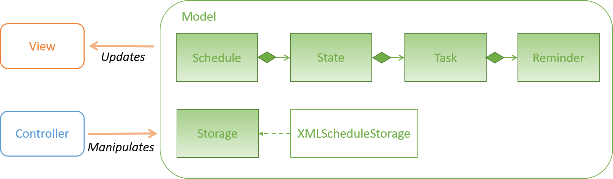
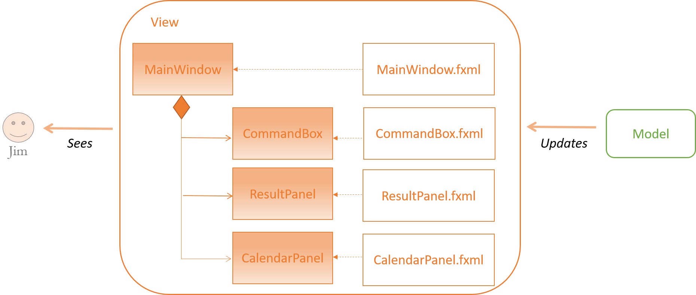
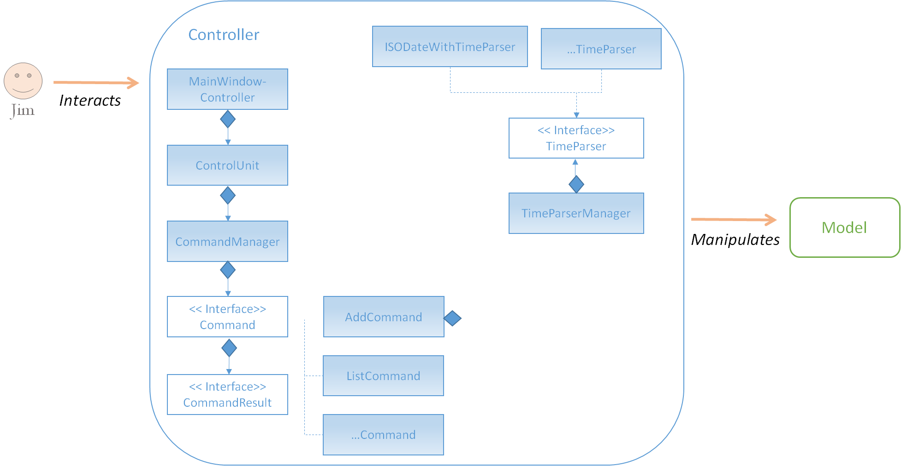
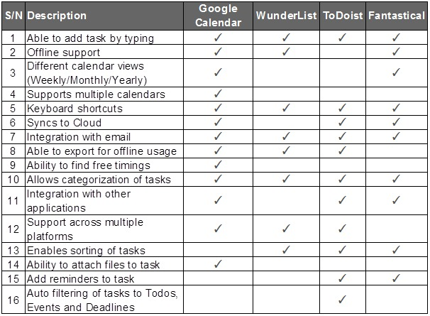

# Developer Guide

* [Introduction](#introduction)
* [Setting Up](#setting-up)
    * [Prerequisites](#prerequisites)
    * [Importing project into Eclipse](#importing-project-into-eclipse)
    * [Coding Standards](#coding-standards)
    * [Troubleshooting](#troubleshooting)
* [Design](#design)
    * [Architecture](#architecture)
    * [Model Component](#model-component)
    * [View Component](#view-component)
    * [Controller Component](#controller-component)
* [Testing](#testing)
    * [In Eclipse](#in-eclipse)
    * [Using Gradle](#using-gradle)
* [Dev Ops](#dev-ops)
    * [Build Automation](#build-automation)
    * [Continuous Integration](#continuous-integration)
    * [Making a Release](#making-a-release)
    * [Managing Dependencies](#managing-dependencies)
* [Appendices](#appendices)
    * [Appendix A: User Stories](#appendix-a--user-stories)
    * [Appendix B: Use Cases](#appendix-b--use-cases)
    * [Appendix C: Non Functional Requirements](#appendix-c--non-functional-requirements)
    * [Appendix D: Glossary](#appendix-d--glossary)
    * [Appendix E: Product Survey](#appendix-e--product-survey)

## Introduction
Linenux is a command-line, task manager application designed for consumers who are quick at typing. Being an open-source project, we understand that there are developers (yes, you) who wants to contribute to the project but do not know where to begin. Thus, we have written this guide to inform newcomers to the project on the key design considerations and the overall software architecture. We hope that by the end of this developer guide, you will in a better position to start working on improving Linenux.

## Setting up

#### Prerequisites

1. **JDK 8** or later.
2. **Eclipse** IDE with **e(fx)clipse** plugin. Follow the instructions given on their [website](https://www.eclipse.org/efxclipse/install.html#for-the-ambitious).
3. **Scene Builder 8.0**. Available for download [here](http://gluonhq.com/labs/scene-builder/).
4. **Gradle**. Follow the instuctions on their [website](https://docs.gradle.org/current/userguide/installation.html?_ga=1.32481590.94426092.1475838180).

#### Importing project into Eclipse

1. Fork this repository and clone the fork to your computer.
2. Open the Eclipse application.
3. Click `File` > `Import` > `General` > `Existing Projects into Workspace` > `Next`.
4. Click `Browse`, then locate the project's directory.
5. Click `Finish`.
6. Run `gradle eclipse` in your terminal to set up the folders in Linenx.
7. Run `gradle run` in your terminal to ensure that everything is working properly.

#### Coding Standards
Our coding standards can be found [here](https://oss-generic.github.io/process/codingstandards/coding-standards-java.html)

To ensure code readablity on Github, please follow the following instructions to set up your Code Formatter Profile on Eclipse:

1. Click `Window` > `Preferences`.
2. Expand `Java` > `Code Style` and select `Formatter`.
3. Click the `Edit` button.


> Figure 1: What you should be seeing at step 3

4. In the `Indentation` tab, under `General settings`, change `Tab Policy` to Spaces Only and check that `Indentation Size` and `Tab Size` are both set to 4.
5. Click `OK` to save the profile.


> Figure 2: Where you can find the settings to be changed

#### Troubleshooting

1. **Eclipse reports that some of the required libraries are missing.**
    * Reason: Required libraries were not downloaded during project import.
    * Solution: Run `gradle test` in your terminal once to refresh libraries.
2. **Eclipse reports compile errors after new commits are pulled from Git.**
    * Reason: Eclipse fails to detect the changes made to your project during `git pull`.
    * Solution: Refresh your project in Eclipse by clicking on it in the package explorer window and pressing `F5`.

## Design

#### Architecture


> Figure 3: Architecture Diagram

Linenux follows the Model-View-Controller (MVC) pattern which is made up of 3 main components.

1. **Model** is where Linenux's data objects are stored. It is independent from the view and controller.
2. **View** is the window that our user sees and interacts with. It updates whenever there are changes to the model.
3. **Controller** is the decision maker and the glue between model and view.

#### Model Component


> Figure 4: Model Diagram

The **Schedule** class stores a collection of states. A **State** is an immutable class that is created whenever a task or reminder is added or deleted from the **Schedule**. This design allows users to `undo` their previous command.

The **Task** class is made up of the name of the task, a start time, an end time and a list of reminders. There are 3 types of tasks:
1. **Deadlines** - tasks that have an end time but no start time.
2. **Events** - tasks that have both start and end times.
3. **To-dos** - tasks that have neither start nor end times.

The **Reminder** class allows our users to set one or more reminders for their tasks.

The **Storage** class allows the in-memory data to persist after the application is closed. The state of the **Schedule** is stored as an XML file called **XMLScheduleStorage**.

#### View Component

> Figure 5: View Diagram

The **View Component** follows the JavaFx UI framework. Each of the classes (**MainWindow**, **CommandBox** etc) has their own respective `.fxml` file stored in `src/main/resources/view`.

#### Controller Component

> Figure 6: Controller Diagram

The **ConsoleController** takes the user input and sends it to the "brain" of Linenux, the "ControlUnit" class. The "ControlUnit" class is in charge of retrieving the appropriate schedule from storage and passing it over to the **CommandManager** class. The **CommandManager** class then delegates the right command based on the user input.

``` java
public CommandResult delegateCommand(String userInput) {
    for (Command command : commandList) {
        if (command.awaitingUserResponse()) {
            return command.userResponse(userInput);
        }
    }

    for (Command command : commandList) {
        if (command.respondTo(userInput)) {
            return command.execute(userInput);
        }
    }

    return this.catchAllCommand.execute(userInput);
}
```
The above code shows how the **CommandManager** class delegates the right command based on the user input. Every command class must implement the **Command** interface. At any point in time, only 1 command is awaiting user response. If there are none, then each command will check if the user input corresponds to the command format.

``` java
public boolean canParse(String userInput) {
    for (TimeParser parser: parserList) {
        if (parser.respondTo(userInput)) {
            return true;
        }
    }

    return false;
}
```
Similarly, the same pattern is used if the command has to parse the time. These commands will have their own **TimeParserManager** and they can pick and choose which **TimeParser** format they want to support.

## Testing

Tests can be found in the `./src/test/java` folder.

#### In Eclipse

* To run all tests, right click on the `src/test/java` folder in the package explorer and choose `Run as` > `JUnit Test`.
* To run a subset of tests, you can right click on a test package, test class or a test in the package explorer and choose `Run as` > `JUnit Test`.

#### Using Gradle

* To run all tests, run `gradle test` command in the terminal.

## Dev Ops

#### Build Automation

Gradle is a build automation tool. It can automate build-related tasks such as:
* Running tests
* Managing library dependecies
* Analysing code for style compliance

The gradle configuration for this project is defined in the build script `build.gradle`.

#### Continuous Integration

Travis CI is a Continuous Integration platform for GitHub projects. It runs the projects' tests automatically whenever new code is pushed to the repo. This ensures that existing functionality and features  have not been broken by the changes.

The current Travis CI set up performs the following things whenever someone push code to the repo:
* Runs the `./gradlew test` command.

#### Making a Release

Linenux automatically creates a new release by using Travis. This can be done by pushing tagged commits to GitHub.

#### Managing Dependecies

A project often depends on third-party libraries. Linenux manages these dependencies using Gradle. Gradle will automatically download all the required dependencies when any Gradle command is invoked.

## Appendices

#### Appendix A : User Stories

Priorities: High (must have) - `* * *`, Medium (nice to have)  - `* *`,  Low (unlikely to have) - `*`


Priority | As a ...  | I want to ...                             | So that I can ...
-------- | :-------- | :---------------------------------------  | :---------------
`* * *`  | user      | see usage instructions                    | have a reference on how to use the App in the event that I do not know the commands or have forgotten them.
`* * *`  | user      | add a new task                            |
`* * *`  | user      | edit a task                               | update the deadlines or other details regarding the task.
`* * *`  | user      | delete a task                             | remove tasks that I no longer need.
`* * *`  | user      | view a task                               | check the details of the task.
`* * *`  | user      | filter list of tasks shown                | see only tasks that are of interest.
`* * *`  | user      | mark a task as done                       | indicate that a task is done so that it doesn't show up as a to-do.
`* * *`  | user      | list tasks by day or deadlines            | plan ahead.
`* * *`  | user      | undo previous commands                    | correct any erroneous actions.
`* *`    | user      | rename a tag                              | update the tags that are used for tasks.
`* *`    | user      | set reminders for tasks                   | make preperations before their stipulated deadlines.
`* *`    | user      | edit a reminder                           | update the details regarding the reminder.
`* *`    | user      | have multiple language support            | choose my preferred working language.
`* *`    | user      | find free time slots                      | make appointments with others.
`* *`    | user      | have a day/week/month view                | more easily digest the information.
`* *`    | user      | print the schedule for the day/week/month | have a hard copy of my schedule.
`* *`    | user      | create personalized alias for commands    | effectively use the commands available.
`* *`    | user      | sync with Google Calendar                 | have the option to view on any devices with access to the Internet.
`*`      | user      | see syntax highlighting                   | more easily discern special keywords and commands.
`*`      | user      | see notifications                         | be constantly reminded without having to open the App.
`*`      | user      | have a mini-window mode                   | the application does not take up the whole screen.


#### Appendix B : Use Cases

##### Use Case: Add task
*MSS*
1. User requests to add task.
2. Linenux adds task into schedule and shows message indicating successful add, including details of added task.
Use Case ends.

*Extensions*
1a. User provides start time without end time.
> 1a1. TaskManager shows error message to indicate that task is not a valid task.
> Use Case ends.

1b. User provides no start time and end time.
> 1b1. Linenux will categorize task as a To-Do.
> Use Case resumes at step 2.

1c. User provides end time without start time.
> 1c1. Linenux will categorize task as a Deadline.
> Use Case resumes at step 2.

1d. User provides start time and end time.
> 1d1. Linenux will categorize task as an Event.
> Use Case resumes at step 2.

1e. User requests to add an event with an overlapping timeslot with an existing event.
> 1e1. Linenux will show the list of overlapping events and prompts user for confirmation to add the event.
> 1e2. User confirms to add task.
> Use Case resumes at step 2.

1e1a. User cancels the add.
> 1e1a1. Linenux shows that task is not added.
> Use Case ends.

##### Use Case: List tasks
*MSS*
1. User requests to list tasks giving certain parameters.
2. Linenux filters all the tasks based given parameters and shows the filtered list of tasks to the User.
Use Case ends.

*Extensions*
1a. User provides no parameters.
> 1a1. Linenux will show all tasks and reminders for the next 7 days to the User.
> Use Case ends.

##### Use Case: Using commands which has a search parameter.
*MSS*
1. User uses a command which has a search parameter(e.g remind, edit, view etc).
2. Linenux will search all task names and perform the command on the found task.
Use Case ends.

*Extensions*
2a. More than one task found with the given search parameter.
> 2a1. Linenux will show the list of tasks, each with their index, found to the user and prompt the user for the index of the task to perform the command on.
> 2a2. User provides the index of the task to perform the command on.
> 2a3. Linenux performs the command on the requested task.
> Use Case ends

2a2a. User provides invalid index(not a number or number out of range).
> 2a2a1. Linenux will show an error message and prompt the User with the list of found tasks again.
> Use Case resumes at step 2a2.

2a2b. User requests to cancel command.
> 2a2b1. Linenux shows that the requested command is not performed.
> Use Case ends.

2b. No tasks were found with the given search parameters.
> 2b1. Linenux shows error that no tasks were found.
> Use Case ends.

##### Use Case: Add reminder to task
*MSS*
1. User requests to add reminder to task, providing search parameters for task.
2. Linenux searches for the task (See Use Case for commands with search).
3. Linenux adds reminder to the found task and shows message indicating successful add, including details of reminder and task that reminder was added to.
Use Case ends.

##### Use Case: Delete task
*MSS*
1. User requests to delete task, providing search parameters for task.
2. Linenux searches for the task (See Use Case for commands with search)l
3. TaskManager deletes specific task from schedule and shows message indicating successful delete, including details of task deleted.
Use Case ends.

##### Use Case: Mark task as done.
*MSS*
1. User requests to mark task as done, providing search parameters for task.
2. Linenux marks found task as done, and shows message indicating task is marked as done, including details of task.
Use Case ends.

##### Use Case: Undo
*MSS*
1. User requests to undo to previous state.
2. Linenux undos to previous state.
Use case ends.

*Extensions*
1a. No previous state to undo to.
> 1a1. Linenux shows error indicating unable to undo.
> Use Case ends

##### Use Case: Edit
*MSS*
1. User requests to edit task, providing search parameters and changes to be made.
2. Linenux searches for the task (See Use Case for commands with search).
3. Linenux processes changes and shows changes made.
Use Case ends.

*Extensions*
1a. Specified changes are invalid.
> 1c1. Linenux shows error message indicating invalid changes.
> Use case ends.

##### Use Case: Exit
*MSS*
1. User requests to exit application.
2. Linenux prompts user to confirm application exit.
3. User confirms exit.
4. Linenux closes.
Use case ends.

*Extensions*
2a. User cancels exit operation.
> Use Case ends.

3a. User confirms exit while Linenux is still processing information (e.g. reading/ saving a file).
> 3a1. Linenux blocks input and closes after process is done.
> Use Case ends.

#### Appendix C : Non Functional Requirements

1. **Backup** - Should be easy for user to backup their data
2. **Documentation** - User guides, Developer guides and UML diagrams available
3. **Efficiency & Response time** - All commands run within 3 seconds
4. **Open source** - Adopt a developer friendly license that permits users to modify and improve the program.
5. **Quality** - Code is peer-reviewed before merging the pull requests.
6. **Reliability** - Code is in accordance to the official Java coding style.
7. **Testability** - Use of Travis Continuous Integration.

#### Appendix D : Glossary

Users are able to create 2 objects, Tasks and Reminders.

Tasks are split into 3 different sub-categories:

1. Deadline: Tasks created with end dates only.
2. Event: Tasks created with both start and end dates.
3. To-do: Tasks created with no start and end dates.

Tasks **cannot** be created with start dates only.

##### Commands Summary

*Legend:*

1. *Optional fields are enclosed in square brackets `[]`.*
2. *The notation `...` means that multiple words can be used for that field.*

| Command    | Description                               | Format                                                                          |
|------------|-------------------------------------------|---------------------------------------------------------------------------------|
| `add`      | Adding a task.                            | `add` TASK_NAME... [st/START_TIME] [et/END_TIME] [#/TAG...]...                  |
| `remind`   | Setting a reminder for a task.            | `remind` KEYWORDS... t/TIME n/NOTE...                                           |
| `edit`     | Editing a task.                           | `edit` KEYWORDS... [n/TASK_NAME...] [st/START_TIME] [et/END_TIME] [#/TAG...]... |
| `editr`    | Editing a reminder.                       | `editr` KEYWORDS... [t/TIME] [n/NOTE...]                                        |
| `rename`   | Rename a tag.                             | `rename` KEYWORDS... #/TAG...                                                   |
| `done`     | Marking a task as done.                   | `done` KEYWORDS...                                                              |
| `delete`   | Deleting a task or reminder.              | `delete` KEYWORDS...                                                            |
| `clear`    | Clearing a set of tasks.                  | `clear` [#/TAG...]                                                              |
| `freetime` | Finding a free timeslot.                  | `freetime` [st/START_TIME] et/END_TIME                                          |
| `list`     | Listing tasks and reminders.              | `list` [KEYWORDS...] [st/START_TIME] [et/END_TIME] [#/TAG...]                   |
| `today`    | Listing tasks and reminders for today.    | `today`                                                                         |
| `tomorrow` | Listing tasks and reminders for tomorrow. | `tomorrow`                                                                      |
| `view`     | Viewing details around a task.            | `view` KEYWORDS...                                                              |
| `undo`     | Undoing the previous command.             | `undo`                                                                          |
| `help`     | Seeking help.                             | `help` [COMMMAND_NAME]                                                          |
| `alias`    | Making aliases for the commands.          | `alias` COMMMAND_NAME n/NEW_NAME                                                |
| `exit`     | Exiting Linenux.                          | `exit`                                                                          |

##### Supported Time Formats

*All of the examples below have the equivalent meaning to the time 26 October 2016, 5.50pm*

| Format             | Example                |
|--------------------|------------------------|
| dd month yy hh.mma | 26 October 2016 5.50pm |
| yyyy-MM-dd hh:mma  | 2016-10-16 5:50pm      |
| ddMMyyyy HHmm      | 16102016 1750          |

#### Appendix E : Product Survey
##### Pros of Products Surveyed

> Figure 7 Pros of Products Surveyed

##### Cons of Products Surveyed:
*Google Calendar*
* Keyboard shortcuts needs to be discovered.
* CLI commands is only for the addition of tasks.
* Unable to add to-dos/floating tasks.
* Inability to mark tasks as completed.
* Only has limited color tags to categorize tasks.

*Todoist*
* Non-intuitive control.
    * Can only view all tasks (in all categories) in 1 page when you select filters → all.
* Cannot show all tasks as 1 single list.
    * Even when showing all tasks, categorized tasks are segregated.
* Many functions only accessible in paid version
    * Exporting, comments, labels, etc.
* No flexibility in setting duration of tasks shown.
    * Can only show tasks due today or within 7 days.
* Navigation can only be done by GLI.
* Only supports To-Dos.

*Wunderlist*
* Only supports To-Dos.
* Only has today and weekly view.
* Only able to add 1 reminder to each task.

*Fantastical*
* Only available on Mac.
* Not free and the paid version is expensive.