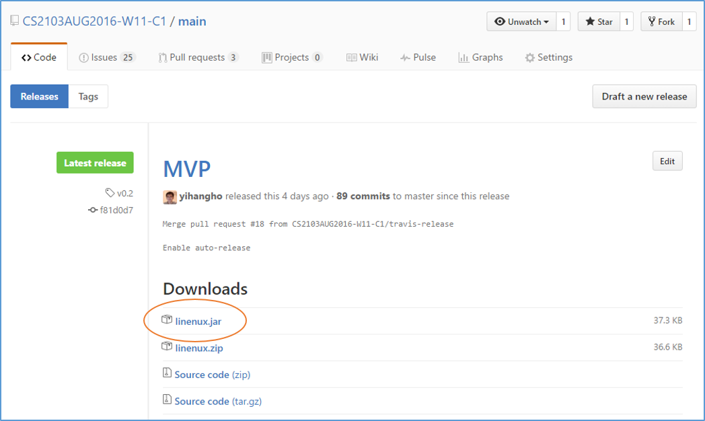
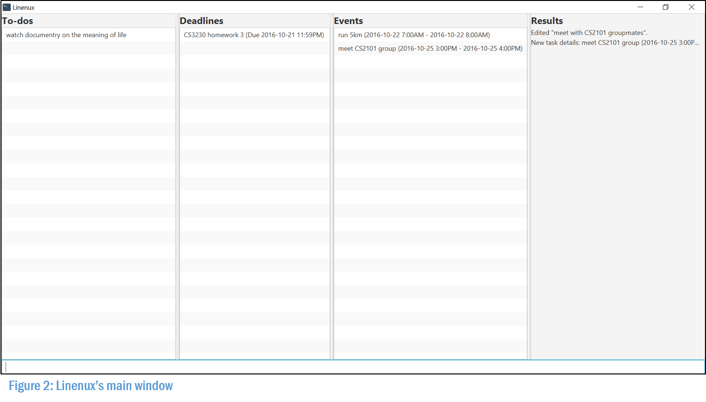
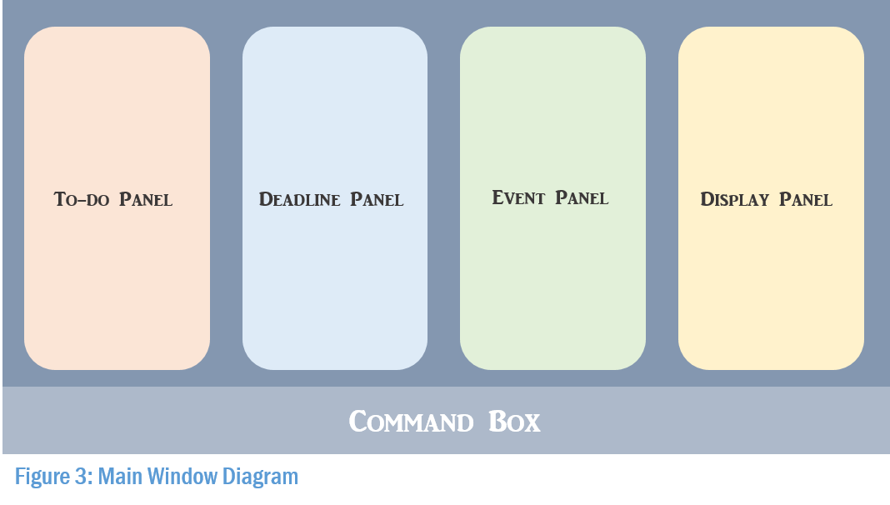

# User Guide

* [About](#about)
* [Getting Started](#getting-started)
    * [Download](#download)
    * [Launch](#launch)
    * [Visual Walkthrough](#visual-walkthrough)
    * [Functional Walkthrough](#functional-walkthrough)
* [Commands Summary](#commands-summary)
* [Supported Time Fomats](#supported-time-formats)
* [Commands](#commands)
    * [Add](#add)
    * [Remind](#remind)
    * [Edit](#edit)
    * [Editr](#editr)
    * [Rename](#rename)
    * [Done](#done)
    * [Delete](#delete)
    * [Clear](#clear)
    * [Freetime](#freetime)
    * [List](#list)
    * [Today](#today)
    * [Tomorrow](#tomorrow)
    * [View](#view)
    * [Undo](#undo)
    * [Help](#help)
    * [Alias](#alias)
    * [Exit](#exit)
* [Shortcut Keys](#shortcut-keys)
* [Conclusion](#conclusion)

## About

Everyone of us will face, at some point in our lives, the feeling of being overwhelmed by the amount of things to do: meeting project deadlines, attending a friend's wedding ceremony, paying the bills and the list goes on. This hectic pace of life is the new normal, but it doesn't mean we have to suffer alone in silence. We believe that everyone should have control over their own lives and Linenux is the key to achieving just that.

Linenux is essentially a task organiser. It helps you to prioritise your tasks by urgency and importance, so that you can better make use of your time by focussing on things that matter. What sets Linenux apart from other task managers is its simplicity and efficiency. It requires only a single line of command. No mouse clicks needed and no gimmicks. Linenux works only as fast as you can type, making it a perfect fit for those with an affinity for typing.

Without further ado, let's get started!

## Getting Started

#### Download

1. Ensure that you have Java 8 installed on your computer.
2. Download the latest linenux.jar from the [releases](https://github.com/CS2103AUG2016-W11-C1/main/releases) tab.

3. Copy the file to the folder that you want to use as the home folder for Linenux.

#### Launch

Double-click on the file to launch Linenux. Wait for a few seconds for the main window to appear.



#### Visual Walkthrough



1. **Command Box** - where you enter the command.
2. **To-do Panel** - shows to-dos.
3. **Deadline Panel** - shows deadlines.
4. **Event Panel** - shows events.
5. **Display Panel** - shows reminders and search results.

*The list of deadlines, events and reminders are always ordered according to their urgency.*

#### Functional Walkthrough

*This section is a scenario driven, step-by-step introduction on how to use Linenux. For a more in-depth coverage of the commands, refer to our [Commands](#commands) section in the user guide.*

*Step 1: Adding a task.*

The date is October 17, 2016. You have to buy groceries from the local supermarket but you are only free to do so on a weekend. You decide to remind youself with the aid of Linenux. Type the following line in the command box:

`> add buy groceries et/2016-10-22 8:00AM`

*Step 2: Setting a reminder.*

You worry that you might not have enough cash to buy groceries and decide to withdraw money from a nearby ATM machine on the way home from work on Friday. Type the following line in the command box:

`> remind buy groceries n/withdraw money et/2016-10-21 6:00pm`

*Step 3: Listing tasks for the day.*

Time flies and it is already Friday. You wonder what needs to be done for the day. Type the following line in the command box:

`> list et/2016-10-21 11:59PM`

or more simply,

`> today`

This will show you the list of tasks and reminders to be done for the day.

*Step 4: Marking a task as done.*

You repeat step 3 on Saturday and realised that you needed to buy the groceries. You hastily went out to buy them, thus completing all of your work for the day. Type the following line in the command box:

`> done buy groceries`

This command will prevent the task from showing up again in subsequent `list` or `today` commands.

*Step 5: Becoming proficient*

You are very impressed with what you have seen thus far and want to learn more about the amazing things you can do with Linenux. Type the following line in the command box:

`> help`

This brings up the list of Linenux commands with their description and format. It is for a quick in-app look-up. Continue to the next section if you want a complete rundown of the details of commands.

## Commands Summary

*Legend:*

1. *Optional fields are enclosed in square brackets `[]`.*
2. *The notation `...` means that multiple words can be used for that field.*

| Command                 | Description                               | Format                                                            	 		  	    |
|-------------------------|-------------------------------------------|---------------------------------------------------------------------------------|
| [`add`](#add) 		      | Adding a task.	   	     	  		          | `add` TASK_NAME... [st/START_TIME] [et/END_TIME] [#/TAG...]...   	 		  	      |
| [`remind`](#remind) 	  | Setting a reminder for a task.  	        | `remind` KEYWORDS... t/TIME n/NOTE...                        	 		              |
| [`edit`](#edit) 		    | Editing a task.   	  		                | `edit` KEYWORDS... [n/TASK_NAME...] [st/START_TIME] [et/END_TIME] [#/TAG...]... |
| [`editr`](#editr)       | Editing a reminder.                       | `editr` KEYWORDS... [t/TIME] [n/NOTE...]                      	 	 			        |
| [`rename`](#rename)	    | Renaming a tag.								              | `rename` KEYWORDS... #/TAG...													                          |
| [`done`](#done) 	      | Marking a task as done.       	  		 	  | `done` KEYWORDS... 										             		 	                        |
| [`delete`](#delete) 	  | Deleting a task or reminder. 	  		      | `delete` KEYWORDS... 										         		 	                          |
| [`clear`](#clear)       | Clearing a set of tasks.					        | `clear` [#/TAG...]											         		 	                          |
| [`freetime`](#freetime) | Finding a free timeslot.   	  		 	      | `freetime` [st/START_TIME] et/END_TIME 				                 		 	            |
| [`list`](#list) 		    | Listing tasks and reminders. 		          | `list` [KEYWORDS...] [st/START_TIME] [et/END_TIME] [#/TAG...]        		 	      |
| [`today`](#today)       | Listing tasks and reminders for today.    | `today` 													        	 		 	                              |
| [`tomorrow`](#tomorrow) | Listing tasks and reminders for tomorrow. | `tomorrow` 													 		 		 	                                  |
| [`view`](#view)         | Viewing details around a task.            | `view` KEYWORDS...        									 		 		 	                          |
| [`undo`](#undo) 		    | Undoing the previous command.          	  | `undo` 				   									     		 		 	                                |
| [`help`](#help) 		    | Seeking help.				  		                | `help` [COMMMAND_NAME]    									 		 		 	                          |
| [`alias`](#alias)       | Making aliases for the commands.          | `alias` COMMMAND_NAME n/NEW_NAME                               		 		 	        |
| [`exit`](#exit) 	   	  | Exiting Linenux. 				  		            | `exit` 			       									     		 		 	                              |

## Supported Time Formats

*All of the examples below are equivalent to 16 October 2016, 5.50pm*

| Format             | Example                |
|--------------------|------------------------|
| dd month yy hh.mma | 16 October 2016 5.50pm |
| yyyy-MM-dd hh:mma  | 2016-10-16 5:50pm      |
| ddMMyyyy HHmm      | 16102016 1750          |

## Commands

*Things to note:*

1. *The `command` word must be the first word in the sentence.*
2. *All commands and their respective fields are case-insensitive.*
3. *The order of the fields do not matter.*
5. *Optional fields are enclosed in square brackets `[]`.*
6. *The notation `...` means that multiple words can be used for that field.*

#### Add

Linenux supports 3 kinds of tasks:

1. **To-dos**    (Tasks without start and end times)
2. **Deadlines** (Tasks with end times only)
3. **Events**    (Tasks with start and end times)

Adding a task has never been this easy. Just indicate the appropriate fields and we will automatically assign the newly created task to one of the three categories above. Tags can be used to group similar tasks together.

*Format:*

`add TASK_NAME [st/START_TIME] [et/END_TIME] [#/TAG...]...`

*Examples:*

```
// Adding a to-do with tag 'trump'.
> add watch videos on presidential election #/trump

// Adding a deadline with tags 'household' and 'bills and money'.
> add pay utility bills et/2016-10-16 5:00PM #/household #/bills and money

// Adding an event with tag 'household'.
> add house warming st/2016-10-16 5:00pm et/2016-10-16 9:00pm #/household
```

#### Remind

Setting reminders is as simple as adding a task. Just specify the appropriate fields and we will assign the reminder to the task that you want. Reminders will show up on the display panel upon launch or when the commands `list`, `today` and `tomorrow` are entered.

*Format:*

`remind KEYWORDS... t/TIME n/NOTE...`

*Examples:*

```
// Setting a reminder for the event 'house warming' with the note 'buy groceries'.
> remind house warming t/2016-10-16 07:00am n/buy groceries
```

*Fun Fact:*

Ever wondered why we use the word `KEYWORDS` rather than `TASK_NAME`? This is because the `remind` command actually searches for task names containing those keywords behind the scene! For example, consider the scenario below :

```
> add cs2101 assignment et/2016-10-16 11:59pm
> add cs2103 assignment et/2016-10-18 11:59pm
> remind assignment t/2016-10-16 10:00pm
```

In this scenario, since there are multiple task names with the keyword `assignment`, both results are returned and you get to choose, via specifying an index, which task is the reminder for. This mechanism is known as fuzzy searching and it is implemented for all commands with the field `KEYWORDS`. How cool is that?

#### Edit

Life would be a breeze if everything had gone according to plan. Unfortunately, things change all the time and we need to be able to respond accordingly. Thankfully, one of the few things in life that is a breeze is the `edit` command. It uses the same fuzzy searching mechanism as `remind` and it will update the respective fields of the task to their new values. However, do take note that for the field tag, it will replace all existing tags of the task. Also, to remove fields, we will use a dash as shown in the examples below. All fields can be removed except `n/TASK_NAME...`.

*Format:*

` edit KEYWORDS... [n/TASK_NAME...] [st/START_TIME] [et/END_TIME] [#/TAG...]...`

*Examples:*

```
// Adding an event with tags 'hobby' and 'rest day'.
> add play golf st/2016-10-16 7:00am et/2016-10-16 9:00am #/hobby #/rest day

// Changing the name of the event from 'play golf' to 'play chess'.
> edit play golf n/play chess

// Changing the starting and ending time of the event 'play chess'.
> edit play chess st/2016-10-16 7:00pm et/2016-10-16 9:00pm

// Replacing both tags 'hobby' and 'rest day' with the tag 'fun'.
> edit play chess #/fun

// Changing 'play chess' from an event to a to-do.
> edit play chess st/- et/-

// Removing all tags associated with the to-do 'play chess'.
> edit play chess #/-
```

#### Editr

This is a variant of the `edit` command but for reminders. It works similar to the `edit` command, with the same fuzzy searching mechanism which searches for a reminder by its note.

*Format:*

`editr KEYWORDS... [t/TIME] [n/NOTE...]`

*Examples:*

```
// Setting a reminder for the event 'house warming' with the note 'buy groceries'.
> remind house warming t/2016-10-16 07:00am n/buy groceries

// Changing the time of a reminder with note.
> editr buy groceries t/2016-10-16 06:00am
```

#### Rename

Renaming a tag will change all tasks with that tag to the new tag.

*Format:*

`rename KEYWORDS... #/TAG...`

*Examples:*

```
// Rename tag 'assignments' to 'nus assignments'.
> rename assignments #/nus assignments
```

#### Done

Yes! You’ve just completed a task. Since it’s completed, you wouldn’t want to see it popping up as a task that is incomplete, would you? Thus, type `done`, along with the task name to mark it as completed.

*Format:*

`done KEYWORDS...`

*Examples:*

```
// Mark to-do 'write user guide' as done.
> done write user guide.
```

#### Delete

At times, tasks or reminders might become redundant. For example, a scheduled meeting might be cancelled due to unforeseen circumstances. The fuzzy searching mechanism for `delete` differs from what we have seen so far because it searches for both tasks as well as reminders. Deleting a task will remove all its reminders, while deleting a reminder will not affect its task.

*Format:*

```
delete KEYWORDS...
```

*Example:*

```
// Delete an event 'cs2103 meeting'.
> delete cs2103 meeting

// Delete a reminder 'buy groceries'.
> delete buy groceries
```

#### Clear

To delete multiple tasks in the same category, the `clear` command can be used. When used on its own, it will delete all tasks marked as done. You can also delete a set of tasks with the same tag by specifying the tag name.

*Format:*

`clear [#/TAG...]`

*Example:*

```
// Clears all tasks marked as done.
> clear

// Clears all tasks with tag 'assignment'.
> clear #/assignment
```

#### Freetime

Sometimes we might need to know when we are free. The `freetime` command shows you all the time slots that are not occupied by events.

*Format:*

`freetime [st/START_TIME] et/END_TIME`

*Examples:*

```
// Finding all free time slots from now to 25 December 2016, 11.59pm.
// (Assuming now is some time before 25 Decemeber 2016.)
> freetime et/2016-12-25 11:59pm

// Finding all free time slots on 16 October 2016 between 7am to 9pm.
> freetime st/2016-10-16 7:00am et/2016-10-16 9:00pm
```

#### List

The default behaviour of the `list` command returns the list of all incomplete tasks and reminders. This may not be particularly helpful as you may have a lot of outstanding tasks. Luckily, you are able to narrow the search space down by specifying the various fields. You can chain multiple and separate fields together.

*Format:*

`list [KEYWORDS...] [st/START_TIME] [et/END_TIME] [#/TAG...]`

*Examples:*

```
// Lists all incomplete tasks and reminders.
> list

// Lists all incomplete tasks and reminders containing the word `assignment`.
> list assignment

// List all incomplete tasks and reminders from now to 25 December 2016, 11.59pm.
// (Assuming now is some time before 25 Decemeber 2016.)
> list et/2016-12-25 11:59pm

// List all incomplete tasks and reminders from 16 October 2016, 12.00am to 25 December 2016, 11.59pm.
> list st/2016-10-16 12:00am et/2016-12-25 11:59pm

// List all completed tasks.
> list #/done

// List all incomplete tasks with tag 'assignment'.
> list #/assignment

// List all incomplete tasks from 16 October 2016, 12.00am to 25 December 2016, 11.59pm and with tags 'assignment'.
> list st/2016-10-16 12:00am et/2016-12-25 11:59pm #/assignment
```

#### Today

Seeing as how you might want to know today's tasks frequently, instead of typing `list et/2016-10-16 11:59pm` (assuming today's date is 16 October 2016), we made it into a command itself! If you have events that span from today to the next day, it will be shown as well.

*Format:*

`today`

*Example:*

```
// List all tasks from now to 11.59pm that same day.
> today
```

#### Tomorrow

Similar as the command `today`, this is a syntactic sugar which is equivalent to `list st/2016-10-16 12:00am et/2016-10-16 11:59pm`, assuming that the date tomorrow is 16 October 2016. If you have events that span from tomorrow to the day after tomorrow, it will be shown as well.

*Format:*

`tomorrow`

*Example:*

```
// List all tasks the next day.
> tomorrow
```

#### View

The command `list` only provides the general details surrounding a task. To see all the reminders associated with a task, use `view`.

*Format:*

`view KEYWORDS...`

*Example:*

```
// View details regarding the deadline.
> view cs2101 assignment
```

#### Undo

We all make mistakes in life, but we believe in second chances. After all, we are mere mortals. With the `undo` command, we will turn a blind eye to your previous commands. However, do note that not all mistakes can be forgiven. Only the following command can be undone:

*Undo-able Commands:*

1. `add`
2. `remind`
3. `edit`
4. `editr`
5. `rename`
6. `done`
7. `delete`
8. `clear`

You can undo up to ten such commands.

*Format:*

`undo`

*Example:*

```
// Undo previous undo-able commands, if any.
> undo
```

#### Help

We all need a helping hand every once in a while. Lucky for you, we are with you every step of the way. If you have forgotten how to use a command, or want to know more about what Linenux can do, just type `help` and we will tell you all that you need to know. You no longer need to refer to this user guide every now and then, or carry a heavy user manual everywhere you go. How convenient is that?

*Format:*

`help [COMMMAND_NAME]`

*Example:*

```
// Help for all commands.
> help

// Help for add command.
> help add
```

#### Alias

Ever felt that the command `tomorrow` is too long to type? Or if you have a better name for a command? Well, the `alias` command allows you to create aliases for commands. Do note that creating aliases does not remove the original command word, but rather you can alternate between both. Note that the alias has to be a single word consisting of only alphabets and numbers.

*Format:*

`alias COMMAND_NAME NEW_NAME`

*Example:*

```
// Adding an alias for tomorrow.
> alias tomorrow tmr

// Listing all incomplete tasks and reminders for the next day.
> tmr

// Original command tomorrow should still work.
> tomorrow
```

#### Exit

Although we are sad to see you go, if you have got to go, we believe you should go happy.

*Format:*

`exit`

*Example:*

```
// Exits the program. It is the equivalent to closing the window by clicking the 'X'.
> exit
```

## Shortcut Keys

*These keyboard shortcuts are not commands, but they help speed up navigation in Linenux. We hope that you find these shortcuts helpful.*

| Key        | Function                                                                                |
|------------|-----------------------------------------------------------------------------------------|
| <kbd>↑</kbd> / <kbd>↓</kbd> | Cycles through your most recently used commands without having to type everything again. |
| <kbd>Tab</kbd>| Autocompletes the command word for you. 												   |

## Conclusion

Thank you for taking the time to read our user guide. Please feel free to post in our [issue tracker](https://github.com/CS2103AUG2016-W11-C1/linenux/issues) if you notice any bugs or have any suggestions on how to improve. We will be extremely happy to hear from you so we can make Linenux even better. With that, have fun organising your tasks!
